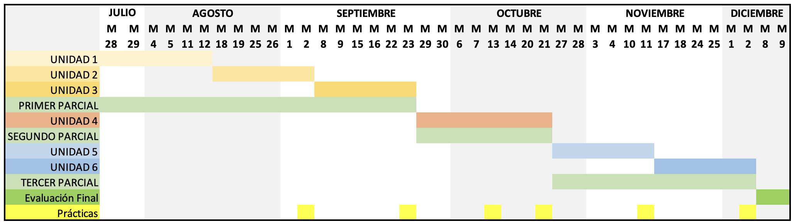

# PLAN DE ASIGNATURA

## INF 672 — MACHINE LEARNING

**Marco referencial:** El programa docente del proceso enseñanza-aprendizaje está estructurado en correspondencia a los lineamientos del modelo académico. La asignatura responde al fortalecimiento de la mención "Ciencia de Datos e Inteligencia Artificial", así como al perfil declarado en el proyecto curricular de la Carrera de Ingeniería Informática. La asignatura de "Machine Learning" tiene como elementos de formación:

- Análisis de datos y modelado predictivo: preparación, exploración y transformación de datos, y construcción de modelos de aprendizaje automático supervisado y no supervisado que permitan el reconocimiento de patrones y la generación de predicciones para la toma de decisiones, aplicando estándares y buenas prácticas de la ciencia de datos.

---

## I. IDENTIFICACIÓN DE LA ASIGNATURA

| Campo | Detalle | Campo | Detalle |
|---|---|---|---|
| **Facultad:** | Ciencias Puras | **Carrera:** | Ingeniería Informática |
| **Asignatura:** | Machine Learning | **Sigla y código:** | INF 672 |
| **Pre-Requisito:** | INF 520 | **Total de horas:** | 5 horas/semana |
| **Trabajo Independiente semanal:** | 5 horas | **Número de créditos:** | 5 |
| **Horas teóricas:**   **Horas prácticas:**   **Horas laboratorio:** | 2   0   3 | **Semestre:** | Sexto Semestre   (Mención Ciencia de Datos e Inteligencia Artificial) |
| **Docente:** | M. Sc. Huáscar Fedor Gonzales Guzmán | **Email:** | huascar.fedor@gmail.com |

---

## II. FUNDAMENTACIÓN Y JUSTIFICACIÓN

El Machine Learning constituye uno de los pilares fundamentales de la ciencia de datos y de la inteligencia artificial modernas. Reúne el conjunto de métodos, algoritmos y procesos que permiten a los sistemas informáticos aprender patrones a partir de los datos, sin ser programados de forma explícita para cada tarea, y con ello realizar predicciones, clasificaciones y descubrimientos que sostienen la toma de decisiones basada en evidencia.

El interés en el aprendizaje automático responde a los mismos factores que han impulsado el auge de la ciencia de datos: el crecimiento en volumen y variedad de datos disponibles, el abaratamiento del procesamiento computacional y del almacenamiento, y la madurez de bibliotecas de código abierto que hacen accesible su implementación. Esto permite construir modelos de manera rápida y automática, capaces de analizar datos grandes y complejos, y de producir resultados precisos incluso a gran escala.

La asignatura introduce al estudiante en el flujo completo de un proyecto de Machine Learning: la preparación y exploración de los datos, la selección de características, el entrenamiento de modelos de regresión, clasificación, redes neuronales y aprendizaje no supervisado, así como su evaluación rigurosa mediante métricas y técnicas de validación. Todo ello con un enfoque eminentemente práctico y orientado a proyectos reales implementados en Python.

Su inclusión en el currículo, dentro de la mención de Ciencia de Datos e Inteligencia Artificial, responde a la creciente demanda del mercado laboral por profesionales capaces de extraer valor de los datos y de construir soluciones inteligentes. El dominio de estas competencias habilita al egresado para participar en proyectos de analítica avanzada, ciencia de datos e inteligencia artificial, tanto en entornos empresariales como en iniciativas de investigación y emprendimiento tecnológico.

---

## III. PROPÓSITO

La asignatura de "Machine Learning" tiene como propósito formar en el estudiante las competencias conceptuales, procedimentales y actitudinales necesarias para diseñar, implementar y evaluar modelos de aprendizaje automático mediante el lenguaje Python y sus bibliotecas especializadas. A través de un enfoque práctico y orientado a proyectos reales, el estudiante adquirirá la capacidad de reconocer patrones sobre conjuntos de datos, construir modelos predictivos y de clasificación fiables, aplicar algoritmos de aprendizaje no supervisado y comunicar resultados con rigor, integrando principios de calidad, validación y ética en el tratamiento de los datos.

---

## IV. COMPETENCIAS DE LA ASIGNATURA

### 4.1. Competencia Global de la Asignatura

Diseña, implementa y evalúa modelos de Machine Learning supervisado y no supervisado utilizando Python y sus bibliotecas especializadas, aplicando el flujo completo de un proyecto de ciencia de datos —preparación de datos, entrenamiento, validación y selección de modelos— con el fin de resolver problemas de predicción, clasificación y descubrimiento de patrones que favorezcan la toma de decisiones en contextos reales.

### 4.2. Competencias Específicas de la Asignatura

Al finalizar la asignatura, el estudiante será capaz de:

- Comprende los fundamentos del Machine Learning, su taxonomía y su rol dentro de la ciencia de datos, configurando el entorno de trabajo en Python para el análisis de datos.
- Prepara y explora conjuntos de datos aplicando técnicas de limpieza, preprocesamiento, visualización y selección/extracción de características mediante Numpy, Pandas y Matplotlib, sobre una base matemática aplicada.
- Implementa y evalúa modelos de regresión aplicando el flujo de trabajo del Machine Learning: división de datos, validación cruzada, métricas de desempeño, control del sobreajuste y selección del modelo más adecuado.
- Construye modelos de clasificación (SVM, árboles de decisión, ensembles y Naive Bayes) y redes neuronales artificiales, comparando su desempeño mediante métricas apropiadas.
- Aplica algoritmos de aprendizaje no supervisado —clustering, reducción de dimensionalidad y detección de anomalías— e integra lo aprendido en un proyecto de Machine Learning de extremo a extremo.

---

## V. DESARROLLO DE SABERES DE LA ASIGNATURA

| Saber conocer | Saber hacer | Saber ser |
|---|---|---|
| - Conceptos fundamentales del Machine Learning y su rol dentro de la ciencia de datos - Taxonomía del aprendizaje: supervisado, no supervisado, online, batch, basado en instancias y en modelos - Ecosistema de Python para ciencia de datos: Numpy, Pandas, Matplotlib y Scikit-learn - Fundamentos matemáticos aplicados: álgebra lineal, cálculo y probabilidad - Técnicas de preprocesamiento, preparación y selección de características de datos - Modelos de regresión lineal, polinomial y logística - Flujo de trabajo de un proyecto de ML: entrenamiento, validación y evaluación - Overfitting, underfitting, regularización y selección de modelos - Algoritmos de clasificación: SVM, árboles de decisión, ensembles y Naive Bayes - Fundamentos de redes neuronales artificiales y deep learning - Algoritmos no supervisados: clustering, reducción de dimensionalidad y detección de anomalías | - Configurar entornos de trabajo en Python (Jupyter, JupyterLab, Google Colab) - Cargar, limpiar, transformar y visualizar conjuntos de datos - Aplicar técnicas de selección y extracción de características - Implementar modelos de regresión y clasificación con Scikit-learn - Evaluar modelos mediante métricas apropiadas y validación cruzada - Controlar el sobreajuste mediante regularización y selección de modelos - Construir y entrenar redes neuronales con un framework de deep learning - Segmentar datos y detectar anomalías con algoritmos no supervisados - Desarrollar un proyecto de Machine Learning de extremo a extremo | - Responsabilidad y ética en el tratamiento de datos y la privacidad - Pensamiento crítico para seleccionar y justificar modelos según el problema - Rigor en la validación y evaluación de resultados - Disposición para el aprendizaje continuo ante la evolución de la IA - Trabajo colaborativo y comunicación efectiva de resultados - Creatividad e iniciativa en la resolución de problemas con datos - Uso responsable y consciente de la inteligencia artificial |

---

## VI. CONTENIDOS TEMÁTICOS DE LA ASIGNATURA

### UNIDAD 1: FUNDAMENTOS DEL MACHINE LEARNING

- 1.1 Contexto y motivación del Machine Learning
- 1.2 El Machine Learning dentro de la ciencia de datos y la inteligencia artificial
- 1.3 ¿Qué es el Machine Learning?
- 1.4 Taxonomía del aprendizaje
  - 1.4.1 Aprendizaje supervisado y no supervisado
  - 1.4.2 Aprendizaje online y batch
  - 1.4.3 Aprendizaje basado en instancias y basado en modelos
- 1.5 Entorno de trabajo en Python
  - 1.5.1 Jupyter Notebook, JupyterLab y Google Colaboratory
  - 1.5.2 Numpy, Pandas y Matplotlib

### UNIDAD 2: DATOS Y FUNDAMENTOS MATEMÁTICOS APLICADOS

- 2.1 Repaso matemático orientado al Machine Learning
  - 2.1.1 Vectores, matrices y producto punto (álgebra lineal)
  - 2.1.2 Derivadas y gradiente (cálculo)
  - 2.1.3 Probabilidad y estadística descriptiva
- 2.2 Manipulación y análisis de datos
  - 2.2.1 Numpy para cómputo numérico
  - 2.2.2 Pandas y análisis exploratorio de datos (EDA)
  - 2.2.3 Visualización de datos con Matplotlib
- 2.3 Preprocesamiento de datos
  - 2.3.1 Tratamiento de valores faltantes
  - 2.3.2 Codificación de variables categóricas
  - 2.3.3 Escalado y normalización
  - 2.3.4 Pipelines de transformación
- 2.4 Selección y extracción de características

### UNIDAD 3: REGRESIÓN Y FLUJO DE TRABAJO DEL MACHINE LEARNING

- 3.1 Regresión lineal
  - 3.1.1 Modelo, función de costo y descenso de gradiente
- 3.2 Regresión polinomial
- 3.3 Flujo de trabajo de un proyecto de Machine Learning
  - 3.3.1 División de datos: entrenamiento y prueba (train/test)
  - 3.3.2 Validación cruzada
  - 3.3.3 Overfitting y underfitting
  - 3.3.4 Regularización (Ridge, Lasso)
  - 3.3.5 Selección del modelo
- 3.4 Métricas de evaluación
  - 3.4.1 Métricas de regresión (MSE, RMSE, R²)
  - 3.4.2 Métricas de clasificación (accuracy, precision, recall, F1, matriz de confusión, ROC/AUC)
- 3.5 Regresión logística como puente hacia la clasificación

### UNIDAD 4: ALGORITMOS DE CLASIFICACIÓN

- 4.1 Máquinas de Vectores de Soporte (SVM)
  - 4.1.1 Clasificación de margen duro y margen suave
  - 4.1.2 Modelo lineal y kernels
- 4.2 Árboles de decisión
  - 4.2.1 Impureza de Gini y entropía
  - 4.2.2 Construcción, profundidad y poda del árbol
- 4.3 Métodos de conjunto (Ensemble Learning)
  - 4.3.1 Bagging y Pasting
  - 4.3.2 Random Forests
  - 4.3.3 Boosting y Stacking
- 4.4 Clasificadores probabilísticos
  - 4.4.1 Teorema de Bayes
  - 4.4.2 Naive Bayes: Gaussiano y Bernoulli

### UNIDAD 5: REDES NEURONALES ARTIFICIALES Y DEEP LEARNING

- 5.1 De la neurona biológica a la artificial
  - 5.1.1 Threshold Logic Unit (TLU)
  - 5.1.2 Perceptrón
- 5.2 Perceptrón multicapa
  - 5.2.1 Funciones de activación
  - 5.2.2 Retropropagación (backpropagation)
- 5.3 Redes neuronales profundas
- 5.4 Introducción a un framework de deep learning (Keras / TensorFlow)

### UNIDAD 6: APRENDIZAJE NO SUPERVISADO

- 6.1 Clustering
  - 6.1.1 K-Means
  - 6.1.2 DBSCAN
  - 6.1.3 Métricas de evaluación: silhouette, Calinski-Harabasz y purity score
- 6.2 Reducción de dimensionalidad
  - 6.2.1 Análisis de Componentes Principales (PCA)
- 6.3 Detección de anomalías
  - 6.3.1 Distribución gaussiana y gaussiana multivariante
  - 6.3.2 Identificación de outliers

---

## VII. MÉTODOS Y ESTRATEGIAS DE ENSEÑANZA-APRENDIZAJE

Se utilizan métodos y estrategias de enseñanza y aprendizaje acordes con el avance de la ciencia y la tecnología educativa y con las necesidades de desarrollo de habilidades y destrezas.

- Explicativo ilustrativo
- Aprendizaje participativo
- Método problémico
- Método expositivo
- Simulación de casos
- Método investigativo
- Aprendizaje basado en proyectos
- Elaboración conjunta

### RECURSOS

- Computadora
- Data display
- Pizarra
- Guías de laboratorio
- Internet
- Plataforma de aprendizaje en línea, oficial de la UATF
- Herramienta de comunicación virtual sincrónica (Meet / Zoom)

### RECURSOS DE LABORATORIO

- Python 3
- Jupyter Notebook, JupyterLab y Google Colaboratory
- Numpy, Pandas y Matplotlib
- Scikit-learn
- Keras / TensorFlow
- VS Code y GitHub

---

## VIII. SISTEMA DE EVALUACIÓN

Por su carácter teórico-práctico con predominancia de laboratorio, la asignatura se evalúa de la siguiente manera:

### Criterios de Evaluación — Asignatura de Teoría y Laboratorio

| Componente | Ponderación |
|---|---|
| Exámenes parciales | 40% |
| Prácticas | 10% |
| Laboratorio | 20% |
| Examen final | 30% |
| **Total** | **100%** |

| Tipo de evaluación | Técnica | Instrumento | Evidencia | Entorno |
|---|---|---|---|---|
| **Diagnóstica** | Interrogatorio (presencial y/o virtual) | Guía de observación | Cuestionario resuelto | Aula / Laboratorio |
| **Formativa** | Desempeño (presencial y/o virtual) | Prueba de laboratorio / rúbrica | Notebooks, presentación y exposición | Laboratorio (presencial y/o virtual) |
| **Sumativa / Producto** | Enunciado, ejercicios y proyecto | Prueba de laboratorio / rúbrica | Presentación del proyecto final | Laboratorio (presencial y/o virtual) |

---

## IX. BIBLIOGRAFÍA

- Géron, A. (2023). *Hands-On Machine Learning with Scikit-Learn, Keras & TensorFlow* (3.ª ed.). O'Reilly Media.
- Raschka, S., & Mirjalili, V. (2020). *Python Machine Learning* (3.ª ed.). Packt Publishing.
- Bagnato, J. I. (2020). *Aprende Machine Learning en Español. Teoría + Práctica Python*. Editorial RA-MA / aprendemachinelearning.com.
- Müller, A. C., & Guido, S. (2016). *Introduction to Machine Learning with Python*. O'Reilly Media.
- James, G., Witten, D., Hastie, T., & Tibshirani, R. (2021). *An Introduction to Statistical Learning with Applications in Python* (2.ª ed.). Springer.
- VanderPlas, J. (2016). *Python Data Science Handbook*. O'Reilly Media.
- Goodfellow, I., Bengio, Y., & Courville, A. (2016). *Deep Learning*. MIT Press.

---

## X. CRONOGRAMA

